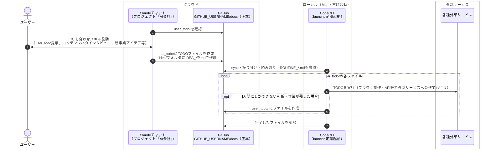

# 運用ループ設計 — 打ち合わせ→GitHub→定期実行→外部サービス

①〜④のループを回すための正式設計。④（開発）の進め方は `ops/inbox/RUNBOOK.md` とローカルのリリース系スキルが正本のため、本書では①〜③の実装だけを扱う。

## ドキュメント一覧

置き場所は GitHub `GITHUB_USERNAME/docs`（=ローカル `docs/`）のリポジトリ直下基準。打ち合わせ時にチャットが作るファイルは直下に置けばよく、③の振り分けが下表の置き場所へ移動する（最初から置き場所に作ってもよい）。

| 書類名 | 命名規則 | 置き場所 | 作成頻度 | 作成担当（Claude） | 概要 |
| --- | --- | --- | --- | --- | --- |
| 会社正本 | COMPANY.md | 直下 | 一度きり（更新して運用） | ー | 理念や事業内容等、会社の基本情報 |
| TODO | ai_todo/{YYYYMMDD}_{状態}_{要点}.md | ai_todo/ | TODO発生時（1TODO=1ファイル） | チャット（クラウド） | CodeCLIが実行すべきTODO。状態はファイル名で管理し、変更はリネームで行う（定義は③）。完了したらファイルごと削除する |
| ルーティン | ROUTINE_{頻度}.md | routine/ | 頻度の新設時（更新して運用） | ー | CodeCLIが定期的に実行すべきTODOリスト。頻度ごとに1ファイルで、同頻度のlaunchdジョブと1対1（例: ROUTINE_hourly.md ↔ 毎時ジョブ） |
| アイデア | IDEA_{YYYYMMDDThhmm}.md | idea/ | 打ち合わせ時 | チャット（クラウド） | どの事業でやるか決まっていない漠然としたアイデア |
| ユーザーTODO | user_todo/{YYYYMMDD}_{状態}_{要点}.md | user_todo/ | 要人間対応の発生時（1TODO=1ファイル） | チャット（クラウド）・CodeCLI | 認証や支払いなど、人間にしかできない作業。状態は `PENDING`。消化したらファイルごと削除する |

## 各ステップの実装

### ① 打ち合わせ（チャット・音声）

進め方の詳細（user_todoの提示・インタビューの仕方・承認フロー・消し込みや重複防止の手順）は claude.ai の打ち合わせスキルが正本。ここには他ステップが前提にする契約だけを置く:

- チャットの出力先は、`ai_todo/` への新規TODOファイル作成・`idea/` への新規IDEA_ファイル・`user_todo/` のファイル作成/削除・純ドキュメントの直接編集（詳細は②）
- `user_todo/` は**人間のボールだけ**を置く場所。AI側の作業は `ai_todo/` で管理し、AIの作業を待つ理由でuser_todoにファイルを残さない
- 理念・企画・原稿など純ドキュメントの修正は、打ち合わせ中にチャットがGitHub MCPで直接編集して完結する。CLIを経由するのはローカル実行環境が絡む場合だけで、それは `ai_todo/` の1ファイルとして扱う

### ② 正本への保存（チャット側の出口）

チャット側はGitHub MCPコネクタで**mdを直接作成・更新する**（コミットメッセージは内容の一行要約。保存・更新の前にファイル名・内容を確認する）。

- CodeCLIへのタスクは `ai_todo/` に `{YYYYMMDD}_未着手_{要点}.md` を新規作成する（1TODO=1ファイル。日付は作成日。状態の定義は③）。作成前に既存ファイルと同件・矛盾がないか一覧で確認する。本文には背景・経緯・関連ファイルを書き、ファイル名の要点はファイル名だけで内容が分かる粒度にする
- アイデアは `IDEA_{YYYYMMDDThhmm}.md` を新規作成する（プレフィックス `IDEA_` が③の振り分けキー）
- `user_todo/` へのファイル作成（`{YYYYMMDD}_PENDING_{要点}.md`）・消化済みファイルの削除も直接行う（同件があれば重複作成しない）
- `ops/` 配下（運用スクリプト・定期実行設定・RUNBOOK）は**CLI管轄**。チャットは読み取りのみとし、変更したいことは `ai_todo/` に積む

### ③ 取得・正本化（定期実行 = launchd + `claude -p`）

launchdが5分間隔で `ops/inbox/run-periodic.sh` を起動する。スクリプトは**正本リポジトリの更新（最新コミットハッシュの変化）を検知したとき、または前回のフル実行から1時間経過したときだけ** `claude -p` のヘッドレスセッションを `periodic-prompt.md` の指示で走らせ、どちらでもなければ静かに終了する（打ち合わせの反映は実質数分以内。更新がなくても最低毎時1回は実行され、ROUTINE_hourlyの毎時保証は維持）。多重起動はロックファイルで防止する（取得失敗は黙って終了、90分超の古いロックは無視）。Desktopアプリのscheduled taskはサンドボックス実行でgit・flutter・gh等が使えないため不採用。定義の正本は `ops/inbox/com.aicompany.periodic.plist` で、変更時は `ops/inbox/install-launchd.sh` で反映する。

1. CLIが `RUNBOOK.md` に従い、直下の未振り分けファイルを振り分け（`IDEA_`→`idea/`、`{YYYYMMDD}_{状態}_...` 形式は状態が `PENDING` なら `user_todo/`・AI側の状態なら `ai_todo/`）→ `ai_todo/` のTODOと `ROUTINE_hourly.md` を実行する。CLI側の編集は同期後のローカルファイルを差分編集し、最後のsyncでGitHubへ書き戻す
2. **TODOは1ファイル1TODOで、状態をファイル名で管理する**（`{YYYYMMDD}_{状態}_{要点}.md`。日付は作成日で以後変更しない。日付が先頭のため、並べたとき古いものが上に来て滞留が見える）。状態変更はリネームで行う（日付部分は据え置き）。状態は記号ではなく文字で書き、定義はここが正本（他のファイルに写さない）:
   - `未着手` — まだ実行していない
   - `完了` — 成功した
   - `要再試行` — CLI側の失敗で、再試行すれば通る可能性があるもの（ネットワーク一時障害・ビルドの揺らぎ等）。次回の定期実行で再試行する
   - `人間待ち` — 人間にしかできない対応が必要で止まったもの（認証エラー・ログイン切れ・支払い・二要素認証等）。定期実行の対象から外し、`user_todo/` に対応依頼のファイルを作成する（同件があれば重複作成しない）。再試行しても直らない失敗を繰り返さないこと
   - `user_todo/` 側の状態は `PENDING` のみ
3. CLIは `未着手`・`要再試行` のファイルだけ実行し、結果に応じてファイルをリネームする。失敗したTODOには本文に理由を併記する。**実行中のTODOの背景・経緯の記述は消さず残す**（何をやろうとしたTODOかの文脈を失わない）。**`完了` になったTODOはファイルごと削除する**（done ディレクトリは作らない。実行内容はローカルの記録に残り、必要なときは git 履歴（`list_commits` に path 指定→`get_commit` full_patch）から参照する。ディレクトリには常に未消化だけが残る）
4. **`人間待ち` の解除は人間の対応後**: 打ち合わせでuser_todoの該当ファイルを消化した際、チャットが `ai_todo/` の該当ファイルの状態部分を `未着手` にリネームして戻す（またはユーザーが直接戻す）。戻ったTODOは次回の定期実行から通常どおり実行される
5. 実行記録はローカル（`ops/inbox/logs/`）のみ。**人間の判断・対応が必要なときだけ** `user_todo/` にファイルを作成する（正本にゴミを増やさない）

## ローカル作業ルール（docs/ の同期 = git）

`~/workspace/docs/` は GitHub `GITHUB_USERNAME/docs`（正本）の作業コピー（gitリポジトリ）で、`ops/sync-docs.sh` で同期する（ローカル変更を自動コミット → pull --rebase → push）。

運用ルール:

1. **セッション冒頭に `ops/sync-docs.sh` を1回叩く**（SessionStart フックで自動実行）。以後 docs/ は「最後に sync した時点の正本」と完全一致で、grep・一括処理・編集はすべてローカル速度
2. **docs/ を編集したら sync を叩いて書き戻す**（ローカル編集はsyncするまで正本に反映されない）
3. 定期実行（③）も処理の前後で sync を叩く

安全弁: 競合はgitのコンフリクトとして顕在化する（黙って上書きしない）。syncが失敗した場合はrebase途中で止まっているので、コンフリクトを解消してから再実行する。全履歴がgitに残るため、誤削除・誤編集はいつでも復元できる。

## フェーズ計画

| フェーズ | 範囲 | 状態 |
|---|---|---|
| 1 | ①②③（振り分け・TODO実行） | **完成**（launchdが更新検知＋毎時で `claude -p` を起動・自動承認で稼働中） |
| 2 | ④ ビルド〜審査提出の自動化 | **完成**（開発TODOで実行。審査提出はTODO明記時のみ） |

## 関連ファイル

- 定期実行の指示書: `ops/inbox/RUNBOOK.md`（セッションへの起動プロンプトは `periodic-prompt.md`）
- 定期実行の仕組み: `ops/inbox/` の `com.aicompany.periodic.plist`（launchd定義の正本）・`run-periodic.sh`（起動スクリプト）・`install-launchd.sh`（冪等の適用スクリプト）
- 実行記録: `ops/inbox/logs/`（gitignore済み・ローカルのみ）。要人間判断は `user_todo/` へ
- `ops/` はいずれもこのリポジトリ内（ローカルでは `~/workspace/docs/ops/`）
